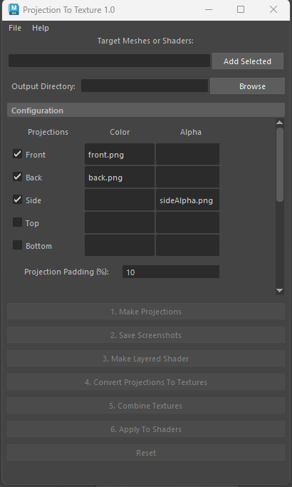

# Maya Projection To Texture

This script provides a semi-automated pipeline for converting 2D projected images to texture maps. 

</img>

Installation/Usage Instructions: <a href="Projection To Texture Instructions.pdf">Projection To Texture Instructions.pdf</a>
