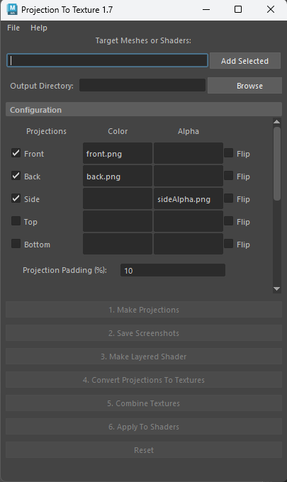

# Maya Projection To Texture

This script provides a semi-automated pipeline for converting 2D projected images to texture maps. 

Installation/Usage Instructions: <a href="Projection To Texture Instructions.pdf">Projection To Texture Instructions.pdf</a>

YouTube Tutorial: <a href="https://www.youtube.com/watch?v=VCAxwzO7qOM">https://www.youtube.com/watch?v=VCAxwzO7qOM</a>

</img>

